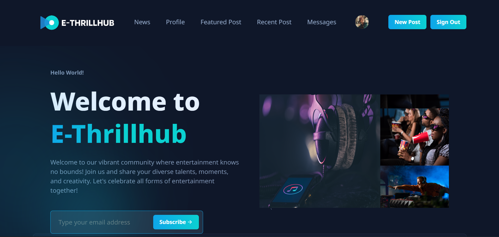

<div align="center">
  

[](https://twitter.com/intent/follow?screen_name=NdefoAfam_)
[](https://twitter.com/intent/follow?screen_name=NwanzeJustin_)

  <br />
  <br />

  <h2 align="center">E-THRILLHUB</h2>

  E-THRILLHUB is a fully responsive social media website, <br />Responsive for all devices, build using Flask, Python, MongoDB, HTML, CSS, and JavaScript.

  <a href=""><strong>➥ Live Demo</strong></a>

</div>

<br />

### Demo Screeshots



### Prerequisites

Before you begin, ensure you have met the following requirements:

* [Git](https://git-scm.com/downloads "Download Git") must be installed on your operating system.

### Run Locally

To run **E-THRILLHUB** locally, run this command on your git bash:

Linux and macOS:

```bash
sudo git clone https://github.com/codewithsadee/wren.git
```

Windows:

```bash
git clone https://github.com/codewithsadee/wren.git
```

### Contact

If you want to contact us you can reach us at [Linkedin](https://www.linkedin.com/in/ndefoafam).
or[Linkedin](https://www.linkedin.com/in/ndefoafam).

### License

[MIT](https://choosealicense.com/licenses/mit/)
